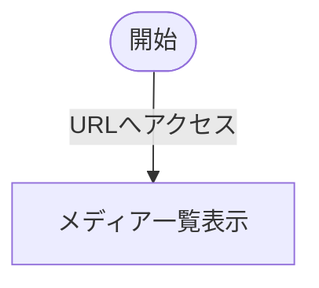

# DisplayMedia.tsx
作成者：豊田

## 用途・役割
- メディア（現在は画像のみ）を表示する
## 構造
### 関数群
| 関数 | 処理 | 引数 | 戻り値 | 備考 |
| :-- | :-- | :-- | :-- | :-- |
| DisplayMedia | メイン処理 メディアを表示 | - | ビュー |  |
| fetchImageUrls | ユーザーIDからメディアURLを取得 | - | URLのString配列 | エラー:URL取得失敗 |

## 状態遷移
- 基本状態
  - 画像を一覧表示

### 状態遷移図

## 仕様
以下に記載
https://ios-ago3482.slack.com/archives/C06JD56SSCR/p1729162312834499
// TODO 仕様の整理

## 実装
修正後に記載