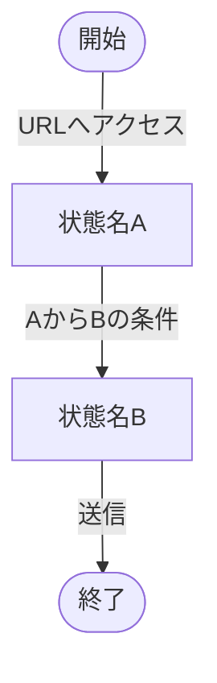

# {ファイル名}
作成者：

## 用途・役割
- ファイルの用途・役割を簡潔に記載

## 構造
- クラスやUtilファイルの場合、メソッドや関数、依存関係を記載
- typeやデータ定義ファイルであれば、期待するデータの内容を記載

## 状態遷移
- 画面など状態を持つファイルなら、状態遷移を記載

### 状態遷移図
- 可能であれば状態遷移図を記載

## 仕様
- より詳細な仕様を記載（省略可）

## 実装
- 現在の実装の、仕様と異なる部分または細かい実装の備考を記載（省略可）

## 備考
- 上記までに含められなかった備考を記載（省略可）